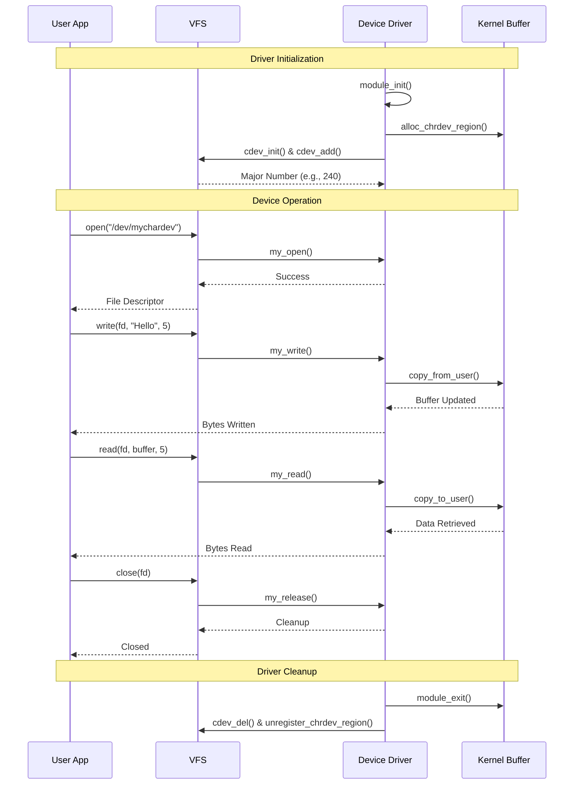

#  Simple Character Device Driver


A comprehensive demonstration of Linux character device driver development showcasing communication between **User-space** and **Kernel-space** through a custom character device.

##  Table of Contents
- [Project Flow](#-project-flow)
- [Architecture](#-architecture)
- [Working Flow](#-working-flow)
- [Yocto Integration](#-yocto-integration-flow)
- [Prerequisites](#-prerequisites)
- [Quick Start](#-quick-start)
- [Procedure](#-procedure)
- [Testing](#-testing)
- [Troubleshooting](#-troubleshooting)

##  Project Flow

```mermaid
graph LR
    A[User Application] -->|open\(\)| B[/dev/mychardev/]
    B --> C[VFS Layer]
    C --> D[Character Device Driver]
    D --> E[Kernel Space]
    E -->|read/write| D
    D -->|copy_to_user| C
    C -->|data| A
    
    style A fill:#e1f5ff
    style B fill:#fff4e1
    style D fill:#ffe1e1
    style E fill:#e1ffe1
```

##  Architecture

```mermaid
graph TB
    subgraph "User Space"
        APP[User Application<br/>./user_app]
        DEV[Device Node<br/>/dev/mychardev]
    end
    
    subgraph "System Call Interface"
        SYS[System Calls<br/>open/read/write/close]
    end
    
    subgraph "Kernel Space"
        VFS[Virtual File System]
        CDD[Character Device Driver<br/>mychardev.ko]
        FB[File Operations<br/>.open .read .write .release]
        KB[Kernel Buffer<br/>mydata[]]
    end
    
    subgraph "Hardware"
        HW[Hardware Device]
    end
    
    APP --> |User I/O| DEV
    DEV --> SYS
    SYS --> VFS
    VFS --> CDD
    CDD --> FB
    FB --> KB
    KB --> HW
    
    style APP fill:#bbdef5
    style CDD fill:#ffccbc
    style KB fill:#c8e6c9
```

##  Working Flow



##  Yocto Integration Flow

```mermaid
graph TB
    subgraph "Yocto Build Environment"
        A[Yocto Setup] --> B[Create Layer]
        B --> C[Driver Recipe]
        C --> D[Kernel Recipe Modification]
        
        subgraph "Layer Structure"
            E[mychardev-layer/]
            F[recipes-kernel/]
            G[recipes-example/]
        end
        
        D --> E
        E --> F
        E --> G
        
        F --> H[linux-yocto_%.bbappend]
        F --> I[mychardev/]
        
        I --> J[mychardev.c]
        I --> K[Makefile]
        
        H --> L[Kernel Config<br/>CONFIG_MYCHARDEV=m]
    end
    
    subgraph "Build Process"
        M[bitbake core-image-minimal] --> N[Kernel Built with Driver]
        N --> O[Root Filesystem Created]
        O --> P[Device Node Rules]
    end
    
    subgraph "Target Device"
        Q[Deploy Image] --> R[Boot Target]
        R --> S[lsmod | grep mychardev]
        S --> T[echo test > /dev/mychardev]
    end
    
    L --> M
    P --> Q
    
    style E fill:#ffe0b2
    style H fill:#b3e5fc
    style M fill:#c8e6c9
```

### Yocto Integration Procedure

#### 1️⃣ **Create Custom Layer**
```bash
mkdir -p yocto/meta-mychardev/{recipes-kernel,recipes-example,conf}
cd yocto/meta-mychardev
```

#### 2️⃣ **Layer Configuration (conf/layer.conf)**
```bitbake
BBPATH .= ":${LAYERDIR}"
BBFILES += "${LAYERDIR}/recipes-*/*/*.bb \
            ${LAYERDIR}/recipes-*/*/*.bbappend"

BBFILE_COLLECTIONS += "meta-mychardev"
BBFILE_PATTERN_meta-mychardev := "^${LAYERDIR}/"
BBFILE_PRIORITY_meta-mychardev = "6"

LAYERDEPENDS_meta-mychardev = "core"
LAYERSERIES_COMPAT_meta-mychardev = "kirkstone"
```

#### 3️⃣ **Kernel Module Recipe (recipes-kernel/mychardev/mychardev.bb)**
```bitbake
SUMMARY = "Simple Character Device Driver"
DESCRIPTION = "A character device driver for Linux"
LICENSE = "GPL-2.0-only"
LIC_FILES_CHKSUM = "file://COPYING;md5=12f884d2ae1ff87c09e5b7ccc2c4ca7e"

inherit module

SRC_URI = "file://mychardev.c \
           file://Makefile \
           file://COPYING"

S = "${WORKDIR}"

do_install() {
    install -d ${D}${base_libdir}/modules/${KERNEL_VERSION}/extra
    install -m 644 ${S}/mychardev.ko ${D}${base_libdir}/modules/${KERNEL_VERSION}/extra/
}

FILES:${PN} += "${base_libdir}/modules/${KERNEL_VERSION}/extra/mychardev.ko"
RPROVIDES:${PN} += "kernel-module-mychardev"
```

#### 4️⃣ **Kernel Config (recipes-kernel/linux/linux-yocto_%.bbappend)**
```bitbake
FILESEXTRAPATHS:prepend := "${THISDIR}/${PN}:"

SRC_URI += "file://mychardev.cfg"

do_configure:append() {
    # Enable the driver in kernel config
    echo 'CONFIG_MYCHARDEV=m' >> ${B}/.config
}
```

#### 5️⃣ **Device Node Creation (recipes-example/mychardev-init/mychardev-init.bb)**
```bitbake
SUMMARY = "Init script for mychardev device node"
LICENSE = "MIT"

inherit update-rc.d

INITSCRIPT_NAME = "mychardev-init"
INITSCRIPT_PARAMS = "start 99 S ."

SRC_URI = "file://mychardev-init"

do_install() {
    install -d ${D}${sysconfdir}/init.d
    install -m 755 ${WORKDIR}/mychardev-init ${D}${sysconfdir}/init.d/
}

FILES:${PN} += "${sysconfdir}/init.d/mychardev-init"
```

#### 6️⃣ **Build with Yocto**
```bash
# Source Yocto environment
source poky/oe-init-build-env build

# Add layer
bitbake-layers add-layer ../meta-mychardev

# Build image with driver
echo 'IMAGE_INSTALL:append = " mychardev mychardev-init"' >> conf/local.conf

# Build the image
bitbake core-image-minimal

# Flash and run on target
runqemu qemux86-64
```

##  Prerequisites

- **Linux Kernel Headers** (`linux-headers-$(uname -r)`)
- **Build Essentials** (gcc, make)
- **QEMU** (for Yocto testing)
- **Yocto Project** (for embedded integration)

##  Quick Start

### Clone & Build
```bash
# Clone repository
git clone https://github.com/yourusername/simple-char-device-driver.git
cd simple-char-device-driver

# Build driver
make

# Check build output
ls -la src/mychardev.ko
```

##  Procedure

### Step 1: Build the Driver Module
```bash
cd src
make clean
make
```

### Step 2: Load Driver into Kernel
```bash
# Insert module
sudo insmod mychardev.ko

# Verify loading
lsmod | grep mychardev

# Check kernel messages
dmesg | tail -10
```

**Expected Output:**
```
[12345.678901] mychardev: Driver initialized
[12345.678902] mychardev: Major number: 240
```

### Step 3: Create Device Node
```bash
# Get major number from dmesg (e.g., 240)
MAJOR=$(dmesg | grep "Major number" | tail -1 | awk '{print $NF}')

# Create device node
sudo mknod /dev/mychardev c $MAJOR 0

# Set permissions
sudo chmod 666 /dev/mychardev

# Verify
ls -l /dev/mychardev
```

### Step 4: Test Driver
```bash
# Build user application
gcc -o user_app user_app.c

# Run test
./user_app
```

**Test Output:**
```
Opening device /dev/mychardev...
Device opened successfully

Writing data to device...
Wrote 12 bytes: Hello Kernel!

Reading data from device...
Read 12 bytes: Hello Kernel!

Closing device...
Device closed
```

### Step 5: Cleanup
```bash
# Remove device node
sudo rm /dev/mychardev

# Unload driver
sudo rmmod mychardev

# Verify removal
dmesg | tail -5
```

## 📊 Testing

### Performance Test
```bash
# Run multiple iterations
for i in {1..100}; do
    echo "Test $i" > /dev/mychardev
    cat /dev/mychardev
done
```

### Stress Testing
```bash
# Install stress tool
sudo apt-get install stress

# Stress test the driver
stress --io 4 --timeout 30s &
./user_app
```

##  Troubleshooting

| Issue | Solution |
|-------|----------|
| `insmod: ERROR: could not insert module` | Check kernel version compatibility<br/>`uname -r` |
| `Permission denied` on /dev/mychardev | Run `sudo chmod 666 /dev/mychardev` |
| Device node not found | Create node with correct major number |
| Module not loading | Check dmesg for errors: `dmesg \| grep mychardev` |
| Yocto build fails | Ensure layer dependencies are met |


##  Contributing

1. Fork the repository
2. Create feature branch (`git checkout -b feature/amazing`)
3. Commit changes (`git commit -m 'Add amazing feature'`)
4. Push to branch (`git push origin feature/amazing`)
5. Open Pull Request

##  License

This project is licensed under the GPLv3 License - see the [LICENSE](LICENSE) file for details.

##  Acknowledgments

- Linux Kernel Development Community
- Yocto Project Documentation
- LWN.net Character Device Drivers Tutorial

---

<div align="center">
Made with ❤️ for Linux Kernel Development
</div>
```

